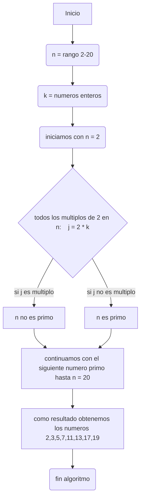

# Reto_3
## En este repositorio se presentaran los pasos a seguir para hallar los numeros primos desde 2 hasta n, basandonos en el Metodo de la Criba de Eratostenes 
### PASOS A SEGUIR
-1: CREAMOS UNA LISTA DESDE 2 HASTA N 

EJEMPLO: N = 20    

(2,3,4,5,6,7,8,9,10,11,12,13,14,15,16,17,18,19,20)

-2: BUSCAMOS LOS MULTIPLOS DE 2 Y LOS MARCAMOS COMO "no primos"

-3: CONTINUAMOS CON EL SIGUIENTE NUMERO PRIMO (3), Y MARCAMOS COMO "no primos" A SUS MULTIPLOS

-4: REPETIMOS HASTA N

-5: FIN

#### PSEUDOCODE
```pseudocode
# definimos un limite
n = rango [2,20]
K = numeros enteros
# excluimos del proceso a el numero 0 y el 1 (los omitimos practicamente)
es_primo[0] = es_primo[1] = False
# iniciamos tomando como valor inicial al numero 2
j = 2
# representamos como no primos a todos los multiplos de 2 
 no_es_primo = 2 * n
# aquellos numeros que no pertenecen al conjunto de los multiplos de dos los marcamos como primos
  sino
   escribir ("es_primo")
# continuamos con el siguiente numero sin marcar como no primo
 j = n + 1
  no_es_primo = j * k
   sino
    escribir ("es_primo")
   continuar
```
mas o menos la representacion completa seria algo asi:
```pseudocode
n = rango [2,20]
k = numeros enteros
es_primo[0] = es_primo[1] = False
 j = (n + 1)
  no_es_primo = (n + 1) * k
  sino
    escribir ("es_primo")
  continuar hasta n = 20
 Fin
FinAlgoritmo 
```
#### DIAGRAMA DE FLUJO 

Con esto damos como completado el reto numero 3. Muchas gracias
